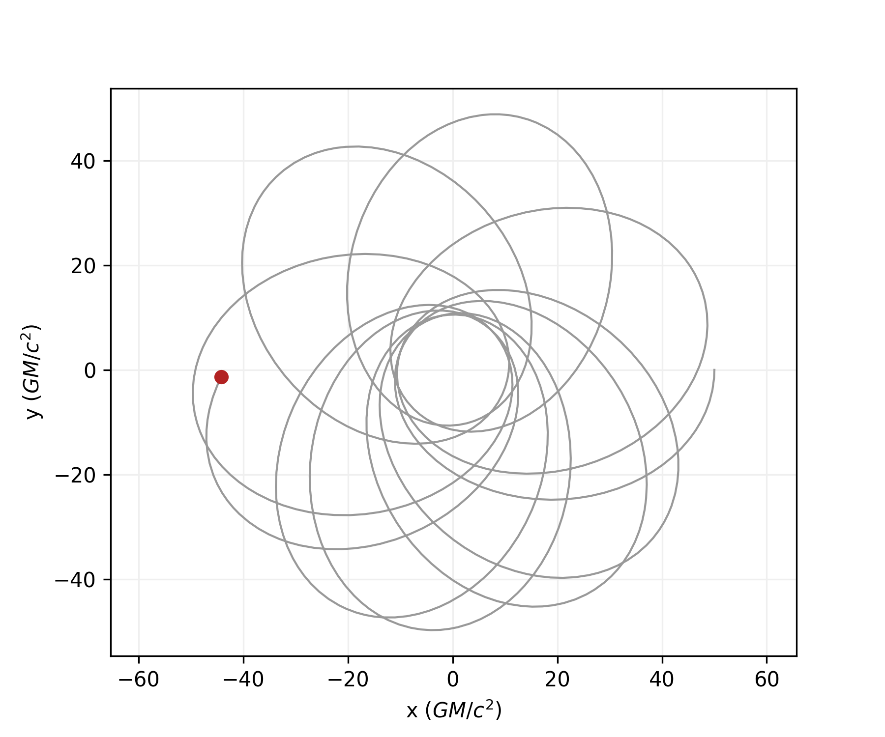

# PyGRO
### A Python integrator for General Relativistic Orbits

[PyGRO](https://github.com/rdellamonica/pigro/tree/master) is a Python library that provides methods and functions to perform the numerical integration of the geodesic equations describing a particle or photon orbit in any metric theory of gravity, given an alaytic expression of the metric tensor.

***

## Installation
PyGRO is distributed as a Python package that can be installed through the PyPi package mangaer via:

```bash
pip install pygro
```

or by cloning this GitHub repository.

## Documentation
The complete documentation for PyGRO is available on [docs](https://github.com/rdellamonica/pigro/tree/master).

***
## Minimal example

PyGRO comes with several built-in spacetimes that can be used to study the motion of test massive and mass-less particles undergoing geodesic motion.

This is an example of time-like geodesic around a Kerr black hole in Boyer-Lindquist coordinates (`default_metrics.KerrBL()`)

```python
import pygro
import numpy as np

metric = pygro.default_metrics.KerrBL(m = 1, a = 0.95)
geo_engine = pygro.GeodesicEngine(metric)

geo = pygro.Geodesic("time-like", geo_engine)
geo.set_starting_point(0, 50, np.pi/2, 0)
geo.set_starting_velocity_direction(0, 90, v = 0.1, angles = "deg")

geo_engine.integrate(geo, 10000, initial_step = 1)
```
Which returns integrated coordinates in the `Geodesic` object.



***
## Copyright

Copyright 2020 Riccardo Della Monica

PyGRO is a free software made available under the MIT License. For details see the LICENSE file.