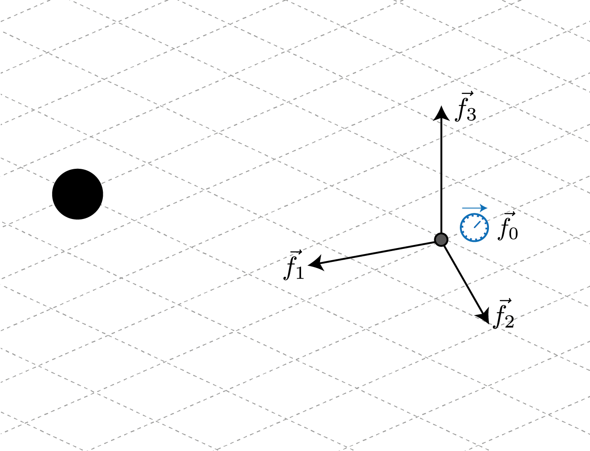
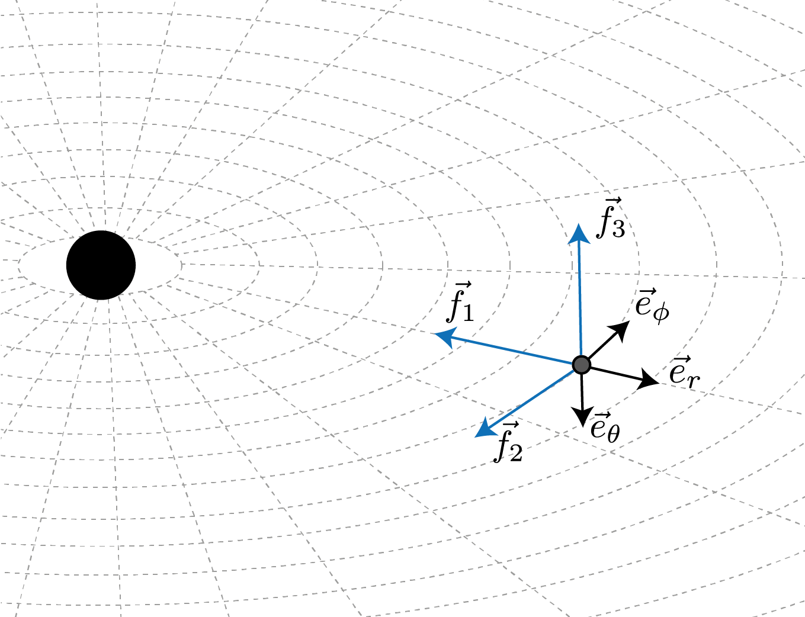
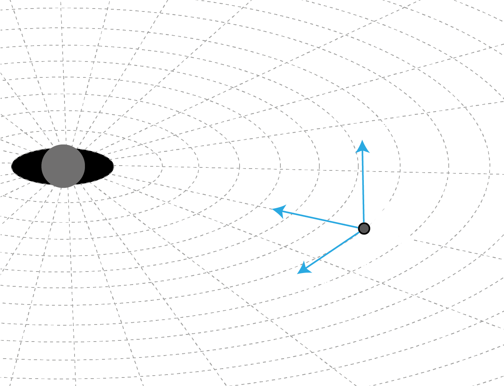
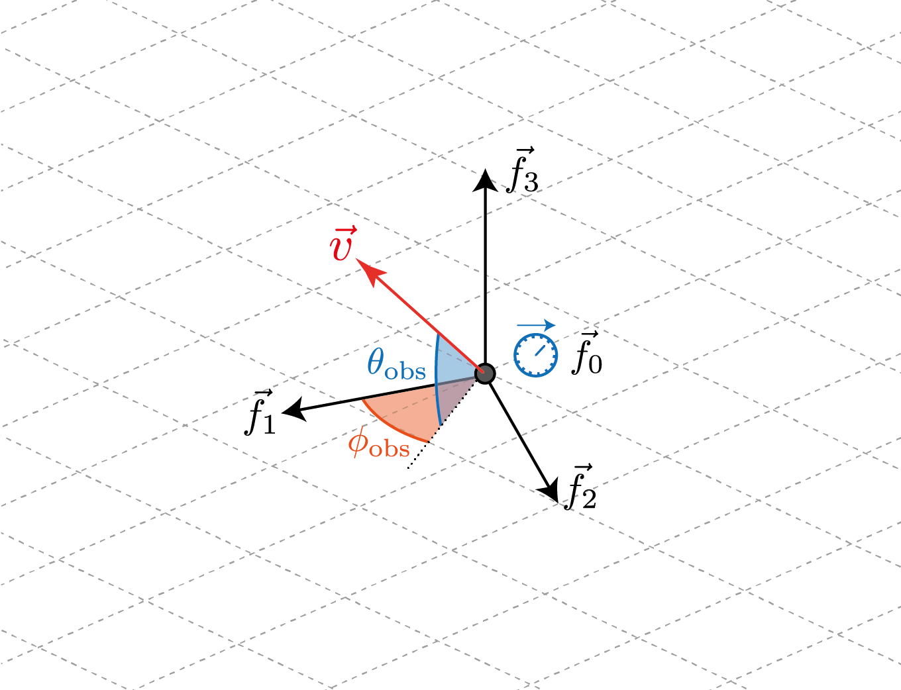
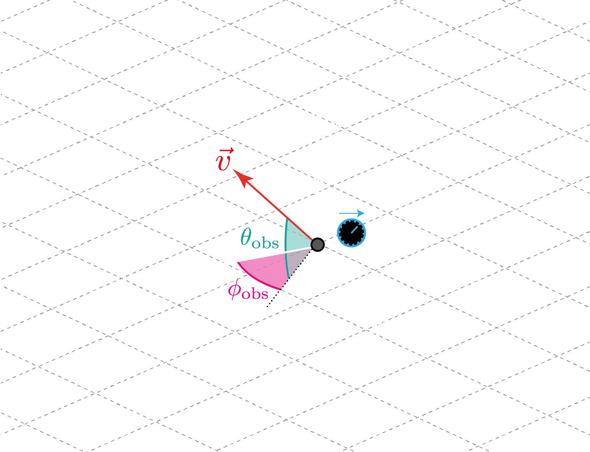
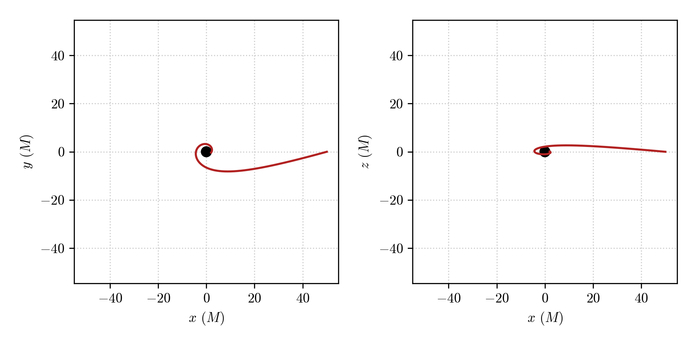
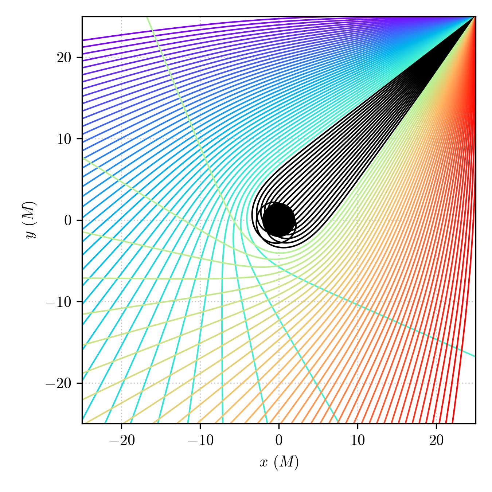

Define a space-time Observer
================================================================

Theoretical background
--------------------------

The approach to General Relativity that employs observer frames is known as the *tetrad formalism* or Cartan formalism. In this framework, it is possible to construct frames (also called vierbein) at each point on the curved manifold, *i.e.* constructing a frame bundle over the manifold. These frames consist of four orthonormal vectors that we denote as :math:`\{f^\alpha_a\}` (greek indices represent the components of the frame vector in the chart coordinates fixed on the manifold while roman indices select one of the frame vector): one time-like vector (:math:`f^\alpha_0`) and three space-like vectors (:math:`f^\alpha_i`), representing respectively the time axis of a given observer and a series of orthonormal spatial axes, forming a spatial tetrad, at a given point. The observer uses thse axes to define tangent vectors to the manifold and project them in a convenient way in its own frame. In this sense, we can say that the frame :math:`\{f^\alpha_a\}` provides a local basis for tangent vectors at the observer's location.

.. image:: _static/observer-illustration-dark.png
  :width: 100%
  :alt: Reference frame of a given observer
  :class: only-dark

Similarly, one can define a co-frame :math:`\{f_\beta^b\}` which forms the basis for tangent 1-forms at the observer's location. 

This can be generalized and one can use the defined frame and co-frame basis to define any tensorial quantity the in the tangent or co-tangent bundle (or any product of these). For example, the metric tensor can be expressed in the coframe as

.. math:: 
    g = -f^0\otimes f^0 + \sum_i f^i\otimes f^i,
    :label: metric-tetrad

corresponding to the relations between the local frame metric and the space-time metric

.. math::

    f_a^\alpha f_\beta^b \eta_{ab} &= g_{\alpha\beta},\\
    f^a_\alpha f^\beta_b g_{ab} &= \eta_{\alpha\beta}.

In other terms, in the local observer's frame the metric is ordinary Minkowski metric, which is a statement of the local flatness in General Relativity.

An example: stationary observers in the Schwarzschild space-time
^^^^^^^^^^^^^^^^^^^^^^^^^^^^^^^^^^^^^^^^^^^^^^^^^^^^^^^^^^^^^^^^^^^^^

Let's consider the Schwarzschild space-time already used in this series of tutorials:

.. math::

    ds^2 = -\left(1-\frac{2M}{r}\right)dt^2+\left(1-\frac{2M}{r}\right)^{-1}dr^2+r^2(d\theta^2+\sin^2\theta d\phi^2).

We want to fix an observer at a certain point so that the :math:`f_1` frame vector points in the radial direction, towards the black hole. The other frame vectors, :math:`f_2` and :math:`f_3` will point along the *angular* directions at the observer's positon, opposite to the coordinate basis vecotor (to ensure the left-handedness of the frame).

When these ingredients are put together, and equation :eq:`metric-tetrad` is taken into account, one can define a co-frame basis for the Schwarzschild metric (expressed in Schwarzschild coordinates and hance defined in terms of the coordinate basis of the co-tangent space :math:`\{dt,\,dr,\,d\theta,\,d\phi\}`) as 

.. math::

    f^0 &= \sqrt{1-\frac{2M}{r}}dt\\
    f^1 &= -\frac{dr}{\sqrt{1-\frac{2M}{r}}}\\
    f^2 &= -r\sin\theta d\phi\\
    f^3 &= -r\,d\theta

From these expressions one can obtain the frame dual :math:`\{f_\alpha^a\}` as the inverse of the coframe matrix :math:`\{f^\beta_b\}` which will be expressed in the coordinate basis of the tangent space :math:`\{\partial t,\,\partial r,\,\partial\theta,\,\partial\phi\}`

.. math::

    f_0 &= \frac{1}{\sqrt{1-\frac{2M}{r}}}\partial_t\\
    f_1 &= -\sqrt{1-\frac{2M}{r}}\partial_r\\    
    f_2 &= -\frac{1}{r\sin\theta} \partial_\phi\\
    f_3 &= -\frac{1}{r}\partial_\theta

As can be seen, the world line of the :math:`f_0` vector is a spatially-fixed line, so that the frame identified represents that of a static observers who use rocket engines to "hover" over the massive object.

Observers in PyGRO
----------------------

Let's now implement the above example in PyGRO, where space-time observers are represented by the abstract class :py:class:`.Observer`.

In this case, creating a new stationary observer at a distance :math:`r=50M` on the equatorial plane of the black hole is as easy as defining:

.. code-block::

    observer = pygro.Observer(
        metric = metric,
        x = [0, 50, np.pi/2, 0],
        coframe = ["sqrt(1-2*M/r)*dt","-dr/sqrt(1-2*M/r)", "-r*sin(theta)*dphi", "-r*dtheta"]
    )

where we have used the expressions of the coframe vectors of the observer's frame defined above. Read :py:class:`.Observer` for a detailed documentation of the API functionality.

PyGRO expects to recieve a list of strings for the symbolic definitions of the frame co-vector expressed in the coordinate co-basis, *i.e.* a linear combination of the differentials ``d[coordinate]`` that matches the coordinate names used to define the :py:class:`.Metric` object (see :doc:`create_metric`).

Alternatively, one can decide to define the observer starting from the frame vectors (instead of co-vectors) expressed in the coordinate basis of the tangent space. In this case PyGRO expects the ``frame`` keyword of the :py:class:`.Observer` be populated by a list of expressions containing the expressions of the frame vectors as a linear combination of the the coordinate basis :math:`\partial_{\{x\}}` that in the code must be represented by ``e[coordinate]``, again matching the coordinate names used to define the :py:class:`.Metric` object.

For example, the same observer defined above can be defined as:

.. code-block::

    observer = pygro.Observer(
        metric = metric,
        x = [0, 50, np.pi/2, 0],
        frame = ["1/sqrt(1-2*M/r)*et","-sqrt(1-2*M/r)*er", "-1/(r*sin(theta))*ephi", "-1/r*etheta"]
    )

.. note::

    The symbolic expressions of both the frame and co-frame vectors can make use of auxiliary expressions and auxiliary functions (see :doc:`create_metric`) as long as these are correctly introduced at the moment of the definition of the :py:class:`.Metric` object.

We can now use the newly defined :py:class:`.Observer` object to set initial conditions for photons or test-particles in a more physical way than done in the previous tutorials (:doc:`integrate_geodesic`). 

To do so, we can use the methods :py:meth:`~pygro.obsever.Observer.from_f1`, :py:meth:`~pygro.obsever.Observer.from_f2` and :py:meth:`~pygro.obsever.Observer.from_f3` of the :py:class:`.Observer` class to fire a geodesic that forms specific angles with respect to the :math:`f_1`, :math:`f_2` and :math:`f_3` frame vectors respectively. To do so, we define the angles :math:`\theta_{\rm obs}` and :math:`\phi_{\rm obs}` that correspond to the usual longitude and latitude in the observer's reference frame taking as origin the given frame vector. 

For example, for the :math:`f_1` case, these angle are illustrated here:

Hence, suppose we want to fire a time-like geodesic starting at the observer's position with a spatial velocity that, in the oberver's reference frame, has an initial direction of :math:`\theta_{\rm obs} = 15^{\circ}` and :math:`\phi_{\rm obs} = 5^{\circ}` from the radial inward-pointing direction (:math:`f_1` direction) and that the module of the velocity is 30% of the speed of light (``v = 0.3`` given the gometrized units that we are using).

This can be done by:

.. code-block::

    geo = pygro.Geodesic("time-like", geo_engine, verbose = False)

    geo.initial_x = observer.x
    geo.initial_u = observer.from_f1(np.deg2rad(15), np.deg2rad(5), type = geo.type, v = 0.3)

The geodesic is correctly initialized and the 4-velocity is already normalized to be a time-like vector. We can proceed to the integration.

.. code-block::

    geo_engine.integrate(geo, 1000, 1, verbose = True)

Which gives the following results:

Looking at the :math:`x-y` and :math:`x-z` planes we can see that the geodesic effectively starts with the given direction in space-time form the observer's location and plunges into the horizon.

Similarly we can deal with light rays (null geodesics) originating at the observer position and integrate them in a *ray-tracing* fashion. For example the code

.. code-block::

    observer = pygro.Observer(
        metric,
        [0, 25*np.sqrt(2), np.pi/2, np.pi/4],
        coframe = ["sqrt(A(r))*dt", "-dr/sqrt(A(r))", "-r*sin(theta)*dphi", "-r*dtheta"]
    )

    phi_arr = np.linspace(-np.pi/4, np.pi/4, 101)
    geo_arr = []

    for phi in phi_arr:

        geo = pygro.Geodesic("null", geo_engine, verbose = False)

        geo.initial_x = observer.x
        geo.initial_u = observer.from_f1(0, phi, type = geo.type)
        
        geo_engine.integrate(geo, 1000, 1, verbose = False)

        geo_arr.append(geo)

Will fire 101 geodesics from the corner of a :math:`25M\times 25M` square on the eqatorial plane of the Schwarzschild black hole, with angles spanning the :math:`[-\pi/4,\pi/4]` (from right to left of the :math:`f_1` vector) towards the black hole and integrate them.

Interestingly, we can use the ``Geodesic.exit`` attribute to identify the geodesics ending up in the horizon and mark them with a different color (see :doc:`visualize`).