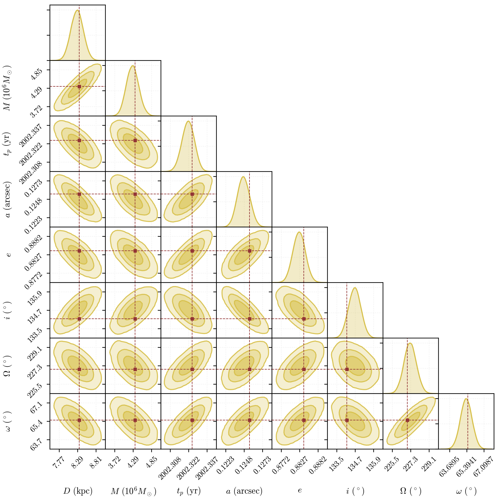
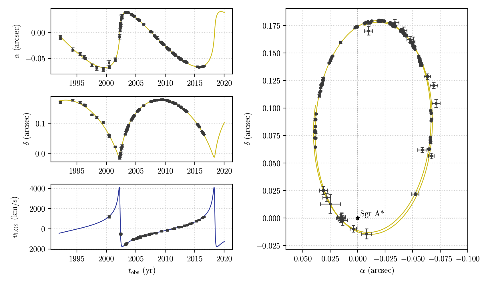

Fitting relativistic orbits to data
===================================

In this example, we will go through how one can use PyGRO in synergy with standard fitting packages (like `emcee <https://emcee.readthedocs.io/en/stable/>`_) to perform parameter estimation of a relativistic orbital model on observational data.

In particular, we will study the orbit of the S2 star in the Galactic Center, orbiting the supermassive black hole Sagittarius A* and fit an orbital model based on the Schwarzschild metric to publicly available data in `Gillessen et al. (2017) <https://iopscience.iop.org/article/10.3847/1538-4357/aa5c41>`_ (which can be found in our `repo <https://github.com/rdellamonica/pygro/tree/master/docs/source/examples/orbital_fitting/data>`_).

The code below can be run to start the orbital fitting, adjusting the parameters of the `emcee <https://emcee.readthedocs.io/en/stable/>`_ sampler to one's computational needs (we refer to the official documentation of the package for further info):

.. literalinclude:: orbital_fitting/S2_MCMC.py
   :language: python

When running the above code and letting in reach convergence, one obtains the following posterior (we only show the posteriors for the orbital parameters):

The credible intervals for all the parameters (reported in the table below) are perfectly compatible with those coming from a keplerian orbital model fitting (from e.g. `Gillessen et al. (2017) <https://iopscience.iop.org/article/10.3847/1538-4357/aa5c41>`_), thus validating the fitting methodology using PyGRO.

.. list-table:: MCMC analysis results for S2
   :header-rows: 1
   :widths: auto

   * - Parameter (unit)
     - Best Fit Value
     - Error
   * - :math:`D` (kpc)
     - 8.29
     - 0.17
   * - :math:`M` (:math:`10^6 M_\odot`)
     - 4.29
     - 0.19
   * - :math:`t_p` (yr)
     - 2002.325
     - 0.005
   * - :math:`a` (arcsec)
     - 0.1250
     - 0.0009
   * - :math:`e`
     - 0.8830
     - 0.0018
   * - :math:`i` (:math:`^\circ`)
     - 134.72
     - 0.40
   * - :math:`\Omega` (:math:`^\circ`)
     - 227.28
     - 0.59
   * - :math:`\omega` (:math:`^\circ`)
     - 65.39
     - 0.57
   * - :math:`\alpha_0` (mas)
     - 0.24
     - 0.13
   * - :math:`\delta_0` (mas)
     - -0.17
     - 0.19
   * - :math:`v_{\alpha,0}` (mas/yr)
     - 0.110
     - 0.041
   * - :math:`v_{\delta,0}` (mas/yr)
     - 0.110
     - 0.051
   * - :math:`v_{\text{LOS},0}` (km/s)
     - -2.1
     - 4.1

The set of astronomical observables obtained assuming the best fit parameters is shown below

