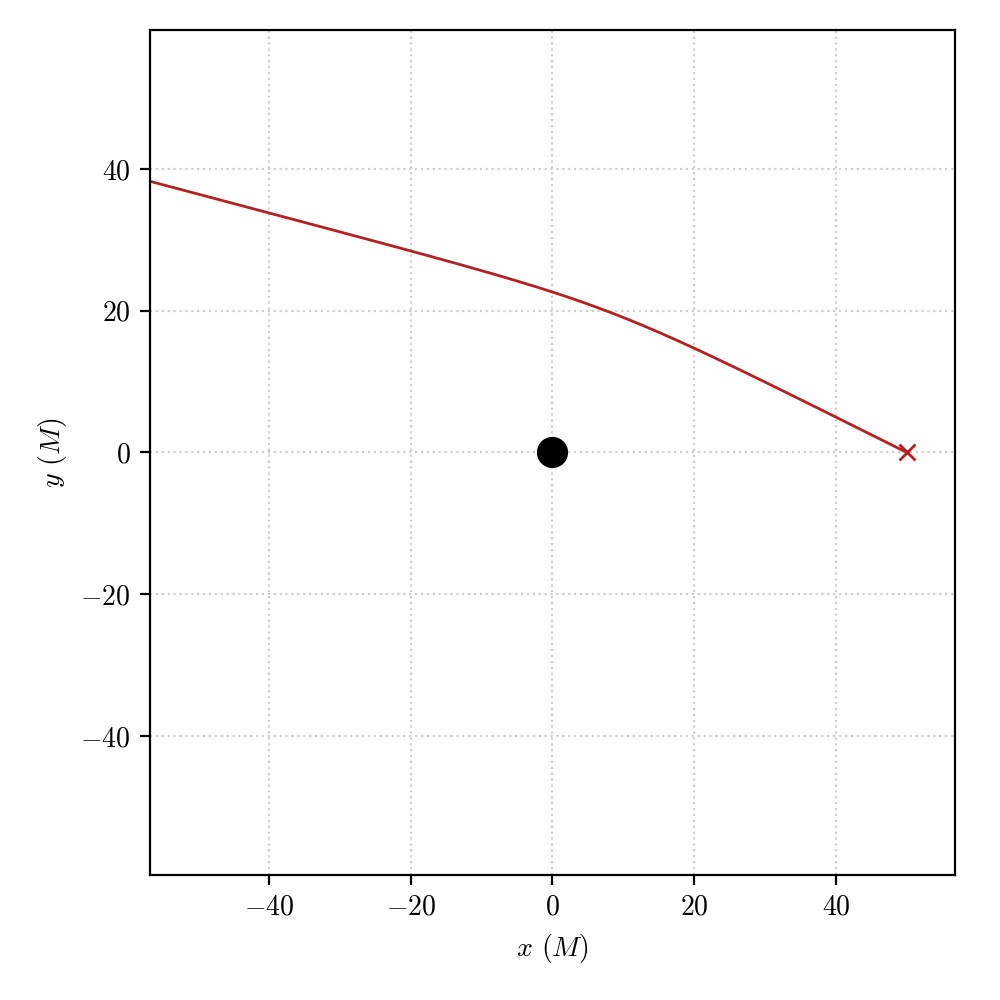
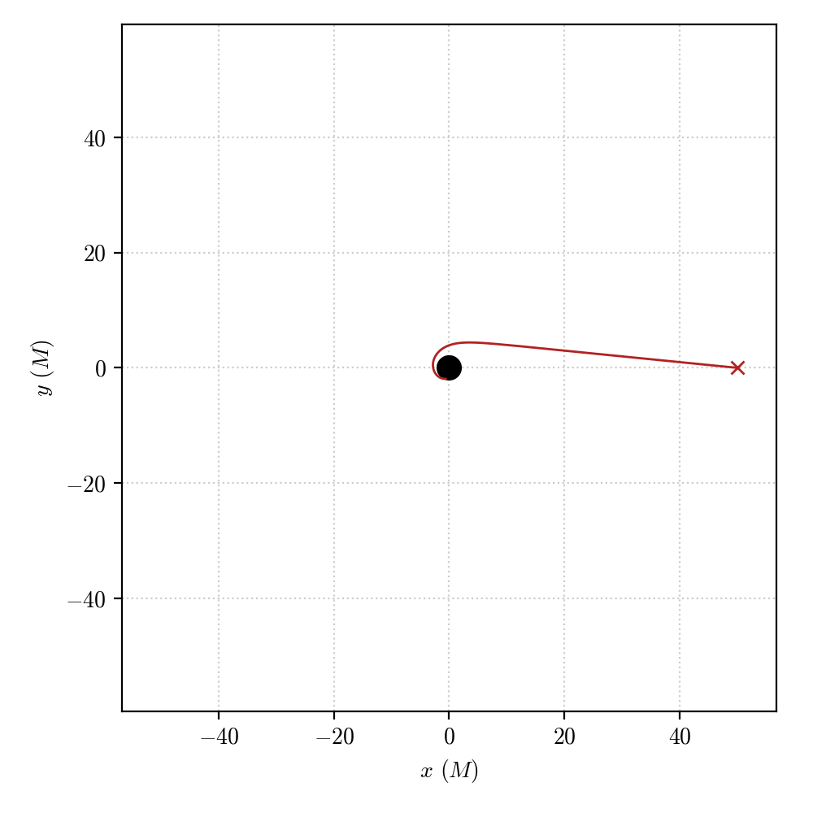

`Null geodesic integration`
================================================================

Null geodesics describe in General Relativity the space-time trajectory of massless particles (e.g. photons). Numerically integrating the equations of motions describing the dynamics of these particles allows performing *ray-tracing*, i.e. to reconstruct the paths that light-rays would follow on a curved space-time around a massive object.

In this tutorial we will examine the procedure in PyGRO to perform this operation and obtain the numerically integrated trajectory of a photon (or a bunch of them) in space-time.

Let's assume that we have a :py:class:`.Metric` object appropriately initialized following the :doc:`../create_metric` tutorial and thus representing the Schwarzschild metric. Moreover, we assume that the we have initialized a  :py:class:`.GeodesicEngine` object and linked it to the Schwarzschild metric, as done in the :doc:`../integrate_geodesic` tutorial. This also means that we have set a :py:class:`.StoppingCriterion` to stop the integration if a geodesic goes very close to the event horizon of the metric (resulting in a ``Geodesic.exit = "horizon"`` exit).

Now we can initialize a new null :py:class:`.Geodesic` in this set-up by simply defining a new object

.. code-block::

    geo = pygro.Geodesic("null", geo_engine)

Before being able to integrate the geodesic, we have to fix an initial position and 4-velocity for the geodesic. These quantities are stored in the ``Geodesic.initial_x`` and ``Geodesic.initial_u`` properties, respectively. While we can fix these properties by hand, it is more convenient to do so using the helper functions of the :py:class:`.Geodesic` class, that guarantee the normalization constraint imposed by the geodesic type. 

We can hence use:

.. code-block::

    geo.set_starting_point(0, 50, np.pi/2, 0)
    geo.set_starting_4velocity(u1 = -1, u2 = 0, u3 = 0.01)

to fix the initial position of the geodesic at a distance :math:`r=50M` from the black hole, on the equatorial plane (:math:`\theta = \pi/2`) and, without loss of generality at a coordinate time :math:`t=0` and along the line :math:`\phi = 0`. Using the :py:meth:`~pygro.geodesic.Geodesic.set_starting_4velocity` method, we have fixed an initial 4-velocity starting from its components :math:`u_r=-1`, :math:`u_\theta=0` and :math:`u_\phi=0.01`, and we are letting the internal helper function of the :py:class:`.Geodesic` autonomously retrieve the corresponding value of :math:`u_t` that satisfies the normalization condition at the given initial point.

We will be alerted of the successful initialization of the :py:class:`.Geodesic` object by the output:

.. code-block:: text

    >>> (PyGRO) INFO: Setting starting point
    >>> (PyGRO) INFO: Setting initial 4-velocity.

Now we are ready to carry out the integration of the :py:class:`.Geodesic` following the scheme depicted in :doc:`../integrate_geodesic`. 

Hence, we can call the method:

.. code-block::

    geo_engine.integrate(geo, 50, 1, verbose=True)

to integrate the :py:class:`.Geodesic` object ``geo`` up to a value of the affine parameter :math:`\tau = 50`, starting with an initial step of 1. The ``verbose = True`` keyword argument makes the integration verbose which will alert us of the status of the integration. In this case, we will be logged

.. code-block:: text

    >>> (PyGRO) INFO: Starting integration.
    >>> (PyGRO) INFO: Integration completed in 0.038264 s with result 'done'.
    
signaling that the integration has been succesful, and has not met any horizon or stopping criterion (since it has an exit string ``'done'``).

We can visualize the resulting geodesic following the :doc:`../visualize` tutorial:

The geodesic obtained by the integration propagates in the gravitational field of the Schwarzschild black hole and gets deflected by a small angle as it approaches the central object.

We can try and repeat the integration by changing the initial 4-velocity, reducing its :math:`\theta` component (*e.g.* by a factor 5) and making it plunge into the horizon.

.. code-block::

    geo_2 = pygro.Geodesic("null", geo_engine, verbose = True)
    geo_2.set_starting_point(0, 50, np.pi/2, 0)
    geo_2.set_starting_4velocity(u1 = -1, u2 = 0, u3 = 0.002)
    geo_engine.integrate(geo_2, 100, 1)

resulting in 

.. code-block:: text
    
    (PyGRO) INFO: Integration completed in 0.10361 s with result 'horizon'.

which can be visualized as

We can play around by changing the starting point of the geodesic and its 4-velocity to see how the the integrated geodesic changes depending on the initial data. Nevertheless, directly using the :py:meth:`~pygro.geodesic.Geodesic.set_starting_4velocity` to fix the initial components of the 4-velocity has its drawebacks as one directly fixes the derivatives of the space-time coordinates at the initial time which in principle have no physical meaning. A much more physical way of fixing the initial conditions is to choose a physical observer, using the :py:class:`.Observer` class and use it to fix initial conditions for null geodesics starting from a specific direction in the observer's reference frame.

This will be explained in more details in the :doc:`../define_observer` tutorial.