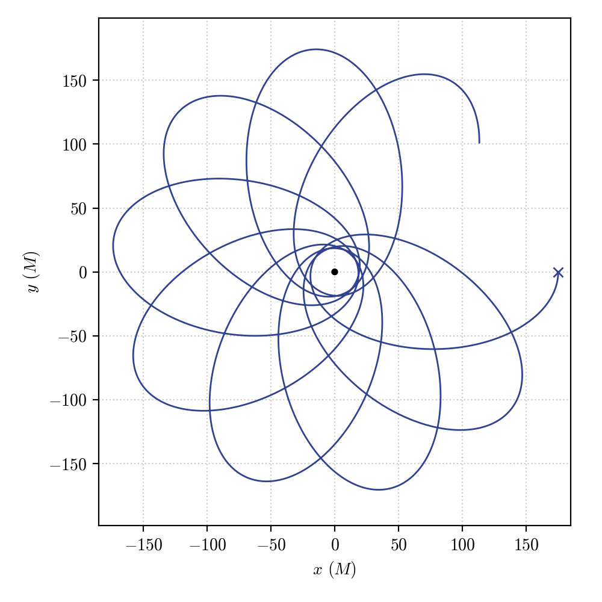

`Time-like geodesic integration`
================================================================

Let's now proceed to the numerical integration of the geodesic equations for a massive particle or, in other words, for the time-like case.

We will retrace the same steps followed for the :doc:`null_geodesic`

.. code-block::

    geo = pygro.Geodesic("time-like", geo_engine)
    geo.set_starting_point(0, 175, np.pi/2, 0)
    geo.set_starting_4velocity(u1 = 0, u2 = 0, u3 = 2e-4)

We have fixed the initial position at :math:`r=175M` on the equatorial plane of the Schwarzschild black hole. Again, we have made use of the :py:meth:`~pygro.geodesic.Geodesic.set_starting_4velocity` method to fix the 4-velocity of the geodesic at the initial time. We are considering a geodesic that initially has only a tangential component (:math:`u_\phi`) of the 4-velocity. 

Carrying out the integration reads:

.. code-block::

    geo_engine.integrate(geo, 50000, 1, verbose=True)

which we stop at an affine parameter :math:`\tau=50000` (which, since we have normalized the geodesic to :math:`g_{\mu\nu}\dot{x}^\mu\dot{x}^\nu = -1`, corresponds to the proper time in units of :math:`M`).

When we :doc:`../visualize` we get

correspoding to a :py:class:`.Geodesic` that quasi-periodically orbits the central black hole while experiencing periastron advance, as expected for a highly relativistic orbit in a Schwarzschild space-time.

Again, we can play around with the initial conditions and see how the resulting geodesics change.

For example, we can consider an array of geodesics all starting at the same point and with an initially tangent 4-velocity and change the value of the tangential component to fix different moduli of the initial spatial velocity. 

.. code-block::

    u3_arr = np.linspace(1e-5, 5e-4, 20)
    geo_arr = []

    for u3 in u3_arr:

        geo = pygro.Geodesic("time-like", geo_engine)
        geo.set_starting_point(0, 175, np.pi/2, 0)
        geo.set_starting_4velocity(u1 = 0, u2 = 0, u3 = u3)
        geo_engine.integrate(geo, 5000, 1)
        
        geo_arr.append(geo)

In this case, we are varying the ``u3`` component of the :py:class:`.Geodesic`, while keeping everything else fixed (of course, the :py:meth:`~pygro.geodesic.Geodesic.set_starting_4velocity` function also changes the initial value of ``u0`` to satisfy the normalization condition) and carrying out the integration up to the same value of proper time (or stopping it at an horizon, given the :py:class:`StoppingCriterion` fixed in the :doc:`../integrate_geodesic` tutorial).

We can :doc:`../visualize` and obtain:

Some of the geodesics will be bound to che central black hole, describing quasi-periodic orbits around it (having stopped the integration at a fixed amount of proper time, some geodesics stop  before having completed a full turn), other plunge into the horizon, not having enough angular momentum to survive the pull of the central black hole.

As for the case of the null geodesics, the :math:`u_\phi` component of the 4-velocity has, in principle, no direct physical meaning. For this reason, if one wants to assign an initial spatial velocity on a physical direction in space and with a given initial spatial velocity relative to a specific space-time observer, the :py:class:`.Observer` class is the most appropriate, for which we refer to the :doc:`../define_observer` tutorial.