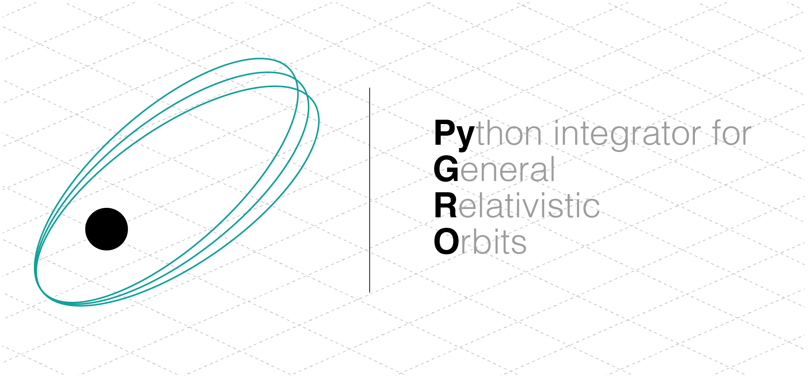
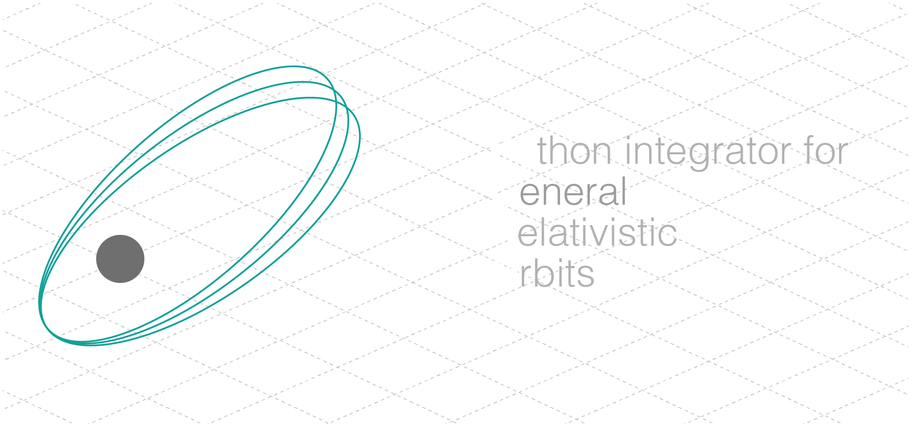

PyGRO [pronounced /'pi.gro/, from the italian **pigro**: *lazy*] is a Python library that provides a series of tools to perform the numerical integration of the geodesic equations describing a particle or photon orbit in any metric theory of gravity, given an analytic expression of the metric tensor.

Documentation
-----------------

This documentation comes with a series of tutorial that will the guide you through the different possibilities that PyGRO offers

.. toctree::
   :maxdepth: 2
   :caption: Tutorials:

   getting_started
   create_metric
   integrate_geodesic
   define_observer
   visualize

with example notebooks:
   
.. toctree::
   :maxdepth: 2
   :caption: Examples:

   examples/Schwarzschild-Precession.ipynb
   examples/Schwarzschild-PhotonOrbit.ipynb
   examples/Schwarzschild-ISCO.ipynb

and with a detailed API guide that provides support for all the classes and methods in PyGRO

.. toctree::
   :maxdepth: 2
   :caption: API:

   metricengine
   geodesicengine
   geodesic
   observer
   integrators

Indices and tables
-----------------

* :ref:`genindex`
* :ref:`modindex`
