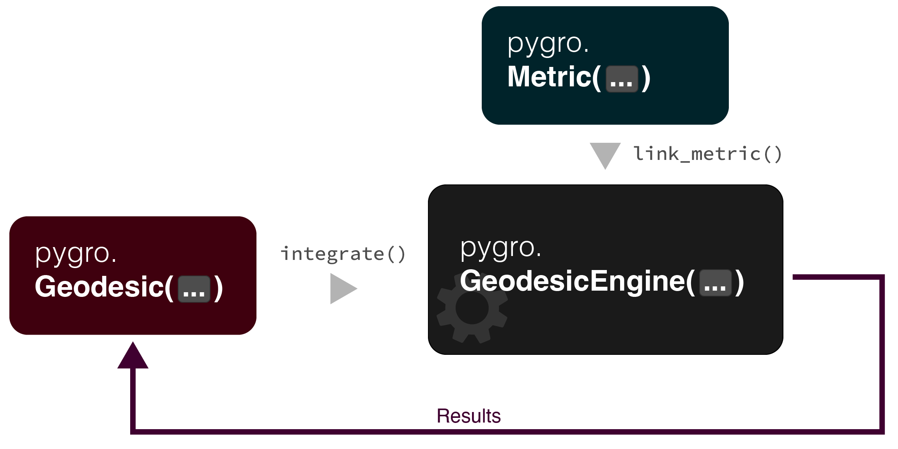

Integrate a geodesic in PyGRO
=============================

Integrating the geodesic equations related to a specific metric tensor is the main goal of PyGRO. The main tool for doing so is the :py:class:`.GeodesicEngine` class. It can be thought of as a *worker* which performs the integration for us, by combining all the information stored in an initialized :py:class:`.Metric` object and using them to integrate the orbit encoded in a :py:class:`.Geodesic` object with a given kind (either *time-like* or *null*) and initial conditions.

Given a generic spacetime described by the metric tensor :math:`g_{\mu\nu}`, the geodesic equations related to this metric read:

.. math::
    
    \ddot{x}^\mu = -\Gamma^{\mu}_{\nu\rho}\dot{x}^\nu\dot{x}^{\rho}.

Here: a dot represents a derivation with respect to an affine parameter :math:`\lambda` by which the geodesic curve is parameterized (for the time-like geodesic case we assume that this affine parameter coincides with the proper time measured by the massive particle); we assume summation over repeated indices; the quantities :math:`\Gamma^{\mu}_{\nu\rho}` represent the Christoffel symbols related to the metric, defined by

.. math::
    
    \Gamma^{\mu}_{\nu\rho} = \frac{1}{2}g^{\mu\sigma}\left(\partial_\nu g_{\sigma \rho} + \partial_\mu g_{\nu \sigma}- \partial_\sigma g_{\nu\rho}\right).

These equations are integrated numerically in PyGRO after initial conditions on both the space-time coordinates (``Geodesic.initial_x``), and initial tangent vector (``Geodesic.initial_u``) have been assigned. Morevoer, before integration, the user has to define whether the desired geodesic is time-like or null. In the following sections we illustrate how to perform these operations in PyGRO.

The first thing to do is initialize of a geodesic engine. This is done by defining a :py:class:`.GeodesicEngine` object and passing to its constructor a initialzed :py:class:`.Metric` object. Additionally, one can pass other arguments to the ``GeodesicEngine`` constructor, namely:

* A ``bool`` to the ``verbose`` argument (which sets whether the steps of the initialization should be printed to the standard output or not);
* The ``backend`` argument whose value can be either ``"autowrap"`` or ``"lambdify"``. In the first case (which is what is set by default), PyGRO converts the call to a specific symbolic expression, in this case, the geodeisc equatioons, into a C-precompiled binary executable. On the other hand, when ``"lambdify"`` is set, PyGRO relies on the native-Python ``sympy`` method ``lambdify`` to perform calls to symbolic expressions. The former **drastically** improves the integration performances, but might not work on particular devices which have no ``gcc`` compiler installed (as for example the Jupyter development environment in `Juno <https://juno.sh>`_, running on iOS) or when one relies on non-symbolic auxiliary functions to define the metric (see :doc:`create_metric`).
* The ``integrator`` argument (default value is ``"dp45"``, correspongind to a Dormand-Prince 4-th order ODE integrator with adaptive step size) by which one can select the numerical integration algorithm that wants to employ (see :doc:`integrators` to see other alternatives).

Assuming default settings are fine for our purposes, we can initialize the :py:class:`.GeodesicEngine` with:

.. code-block::

    geo_engine = pygro.GeodesicEngine(metric)

which links to it the :py:class:`.Metric` object and thus making it an integrator for the geodesic equations related to that specific space-time.

Dealing with horizons
-----------------------------------------

Suppose that the :py:class:`.Metric` object that has been passed to the :py:class:`.GeodesicEngine` constructor is the one that we have initialized in the tutorial :doc:`create_metric`, i.e. the Schwarzschild space-time. As we know, the Schwarzschild coordinates present a coordinate singularity at :math:`r = 2M` which identifies the location of the event horizon of a black hole for an outside observer. Suppose now that we wish to integrate a geodesic that plunges into the black hole (examples of these cases will be shown in the next sections). Since the integration method uses the proper time of the geodesic to parameterize the space-time coordinates, the integration eventually reaches a point of stall where the increment on the proper time between two following steps tends to 0, due to the fact that the proper time of a particle stops at the event horizon. Accordingly, our integration will never reach an end. This happens because in the :py:meth:`~pygro.GeodesicEngine.integrate` method the argument ``tauf`` sets the value of the proper time at which ending the integration. In order to avoid the unconvenient situation in which we have to manually stop the integration, a :py:class:`.StoppingCriterion` can be defined which allows the integration to be stopped automatically when a certain condition is not satisfied. In particular, for the case of the event horizon of a Schwarzschild black hole, we could set the criterion to be that the radial coordinate of the geodesic should always be greater than a value that is a small fraction above the horizon. When this is no longer true, the integration will be stopped and give us a chosen ``exit``. This can be easily done with:

.. code-block::

    geo_engine.set_stopping_criterion("r > 2.00001*M", "horizon")

Here, we have used the :py:meth:`~pygro.GeodesicEngine.set_stopping_criterion` method which accepts as a first argument the symbolic expression of the condition that has to be continuously checked during the integration and as a second argument a string that represent the ``Geodesic.exit`` when the condition is not satisfied.

.. note::
    By default, a successful integration that is completed up to the end point specified in the ``GeodesicEngine.integrate()`` method gives a ``Geodesic.exit == "done"``.
 
Integrating time-like and null geodesics
-----------------------------------------

We can now proceed to the numerical integration of actual geodesics.

.. toctree::

   geodesics/null_geodesic
   geodesics/timelike_geodesic