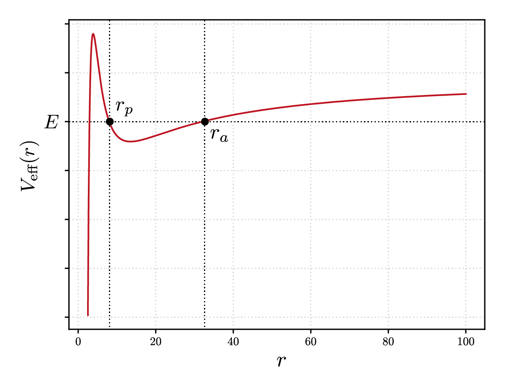
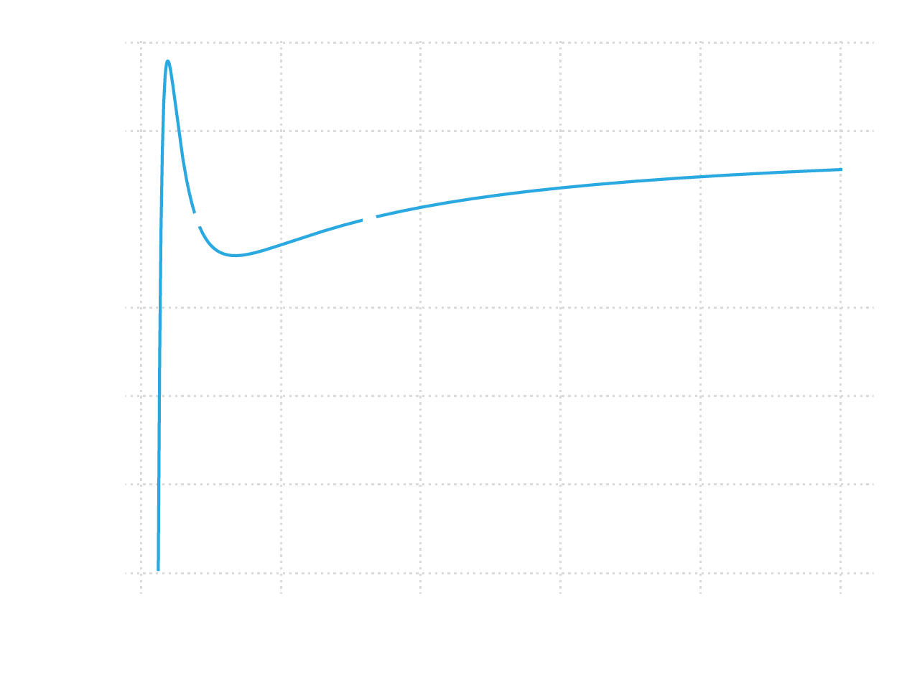
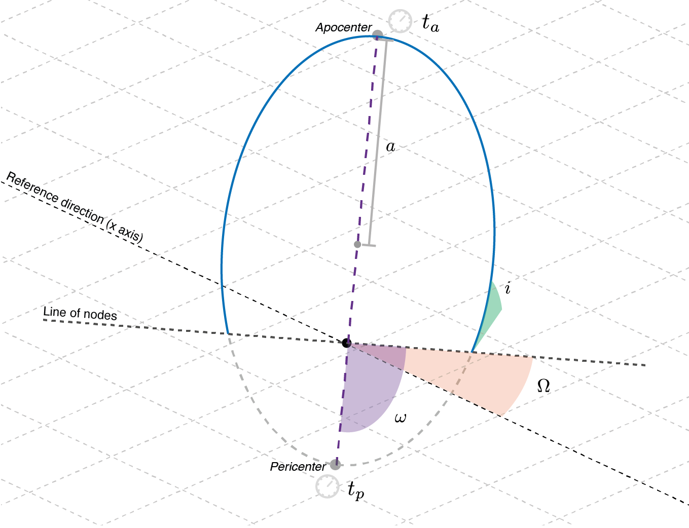
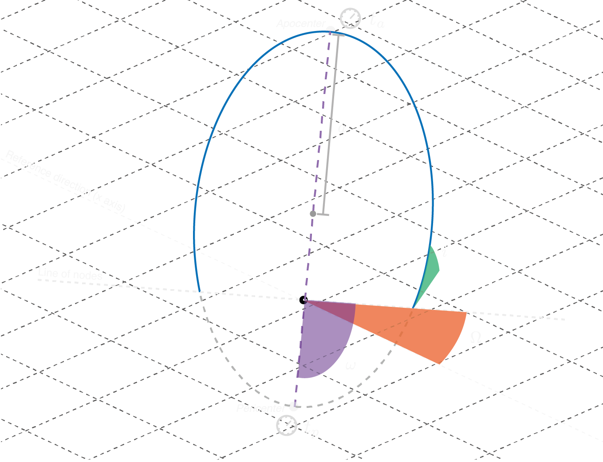
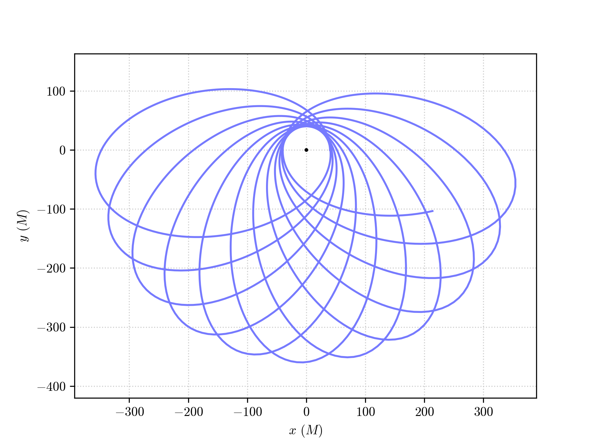

Integrating physical orbits
===========================

The trajectories of massive test particles in PyGRO can be integrated using the low-level :py:class:`.Geodesic` class, by assigning the initial data directly from the values of the space-time coordinates and of the components of the 4-velocity at a given proper time (see :doc:`geodesics/timelike_geodesic`)

Alternatively, one can set the initial conditions by tying the orbit to a physical observer at a given location in space-time and assign initial velocity and direction relative to this observer(see :doc:`define_observer`).

In this tutorial we introduce another possibility. The :py:class:`.Orbit` class, which is a wrapper for the :py:class:`.Geodesic` class in the ``"time-like"`` case, allows to set initial conditions for a massive test particle and to integrate its trajectory, by paramterizing the initial position and velocity in a set of Keplerian elements that are familiar to those of classical celestial mechanics.

.. caution::
    The functionalities of the :py:class:`.Orbit` class and the procedure for assigning initial conditions are guaranteed to work exclusively for spherically symmetric space-times. 

Theoretical background
--------------------------

The geodesic equations, describing relativistic trajectories of test particles, are a system of four second-order differential equations for four unknown functions that describe the spacetime trajectory of a test particle as a function of an affine parameter. For massive particle, describing time-like trajectories, one can choose affine parameter the proper time of the particle.

A solution to the geodesic equations is uniquely determined once second-order initial conditions are assigned. Namely, one has to specify at a any given proper time :math:`s_0` the initial spacetime position of the test particle (*e.g.* for the Schwarzschild space-time :math:`t(s_0)`, :math:`r(s_0)`, :math:`\theta(s_0)`, :math:`\phi(s_0)`) and spacetime 4-velocity (*e.g.* :math:`\dot{t}(s_0)`, :math:`\dot{r}(s_0)`, :math:`\dot{\theta}(s_0)`, :math:`\dot{\phi}(s_0)`). In PyGRO, this is what one should do using the standard :py:class:`.Geodesic` API.

In spherically symmetric space-times (we are considering that the space-time coordinates are :math:`r` for the radial coordinate and :math:`(\theta,\,\phi)` for the latitudinal and azimuthal angles), one can exploit this symmetry to reduce the complexity of the problem. As a matter of fact, one can always perform appropriate rotations to make the trajectory lie on the equatorial plane for the whole duration of the motion. This reduces the number of free parameters, since :math:`\theta = \pi/ 2` and :math:`\dot{\theta} = 0` are assumed implicitly. Moreover, since the metric components (and thus the geodesic equations) do not explicitly depend on the time coordinate :math:`t`, the value :math:`t(s_0)` can be chosen arbitrarily, with no impact on the resulting trajectory. Finally, the normalization condition of the 4-velocity for massive test-particles, :math:`g_{\mu\nu}\dot{x}^\mu\dot{x}^\nu=-1`, represents a constraint on the initial data, thus allowing to derive one of the components of the 4-velocity as a function of the others.

A complete set of initial data that uniquely identifies a trajectory on the equatorial plane of a spherically symmetric spacetime can thus be (:math:`r(s_0)`, :math:`\phi(s_0)`, :math:`\dot{t}(s_0)`, :math:`\dot{\phi}(s_0)`), with :math:`\dot{r}(s_0)` fixed by the choice of :math:`\dot{t}(s_0)` and :math:`\dot{\phi}(s_0)` through the normalization condition.

Instead of fixing the initial conditions directly in terms of these components of the 4-velocity, we introduce a different parameterization in terms of constants of motion. In particular, given the relativistic test-particle Lagrangian, that can be built from the metric tensor

.. math::
  \mathcal{L} = \frac{1}{2}g_{\mu\nu}\dot{x}^\mu\dot{x}^\nu,

one can obtain in spherically symmetric space-times two constants of motion:

.. math::
  E &= -\frac{\partial {\mathcal{L}}}{\partial \dot{t}}\\
  L &= \frac{\partial \mathcal{\mathcal{L}}}{\partial \dot{\phi}}
  :label: EL-lagrangian

And always rewrite the equation of motion on the radial direction as a function

.. math::
  \dot{r}^2 = E - V_\textrm{eff}(r; L)
  :label: dotr2

Where we have introduced the effective potential :math:`V_\textrm{eff}` which is parametrized by the orbital angular momentum and depends functionally on the radial coordinate :math:`r`. A choice of :math:`E` and :math:`L` uniquely fixes the evolution of the radial coordiante and specifically defines the radial turning points, *i.e.* point where :math:`\dot{r} = 0`. In the case of quasi-elliptic orbits (which is the case we are interested in, even though the :py:class:`.Orbit` class can in general be used for any orbital configuration) we call the two radial turning point the pericenter (identified by radial coordinate :math:`r_p`) and the apocenter (identified by :math:`r_a`),

We can invert this mapping and introduce two orbital parameters, namely the eccentricity :math:`e`` and the semi-major axis :math:`a` that have a unique map to the radial turning points

.. math::
  r_p &= a(1-e)\\
  r_a &= a(1+e)

and look for the values of :math:`E` and :math:`L` that make :math:`\dot{r}=0` at both :math:`r=r_p` and :math:`r=r_a`, by numerically solving :eq:`dotr2`.

In the flat space-time limit the orbital parameters that we have introduced perfectly match the concept of semi-major axis and eccentricity classically defined in Newtonian celestial mechanics for Keplerian elliptical orbits. In the General Relativistic case, these parameters depend on the particular choice of coordinates used (for example, in the harmonic gauge of post-Newtonian mechanics, these parameter have a slightly different definition and physical interpretation) and their physical meaning is not uniquely defined in the strong-field regime. They don't thus have a direct physical meaning, but only serve as a familiar and useful parametrization of initial data.

Once the values of :math:`E` and :math:`L` are known, one can invert equations :eq:`EL-lagrangian` to obtain :math:`\dot{t}` and :math:`\dot{\phi}`. We can now choose wheter to start the integration at apocenter or pericenter and fix the rest of initial conditions from there. For example, if we call :math:`t_p` the time of pericenter passage, we have that inital data are

.. math::
    t(s_0) &= t_p\\
    r(s_0) &= a(1-e)\\
    \phi(s_0) &= 0\\
    \dot{r}(s_0) &= 0

and :math:`\dot{t}(s_0)` and :math:`\dot{\phi}(s_0)` are derived with the procedure that we have just explained. This completely fixes the initial conditions on the equatorial plane and allows to integrate the geodesic equations numerically.

To go outside the equatorial plane, we can introduce the standard angular orbital parameters:

- **Inclination** (:math:`i`) measures how much the orbital plane is inclined with respect to the euqatorial plane of the spherically-symmetric space-time considered. The two planes intersect on a line that is known as \emph{line of nodes}. The orbiting object crosses this line two times over one period. The point where it cuts it from below the plane is known as the \emph{ascending node}; the point where it cuts it from above is known as \emph{descending node}.
- **Longitude of the ascending** (:math:`\Omega`), which is the angle between the :math:`x` axis (*i.e.* the one identified by :math:`\theta=\pi/2` and :math:`\phi=0`) and the ascending node.
- **Argument of the pericenter** (:math:`\omega`) between the line of nodes and the semi-major axis of the orbit, specifically its pericenter, ovver the orbital plane.

These angles correspond to three subsequent rotations that bring the orbit into the desired reference frame:

- a rotation :math:`R_1` around the :math:`z` axis by an angle :math:`-\omega` (the minus sign is due to the fact that by definition :math:`\omega` points *towards* :math:`x` and not *from* it);
- a rotation :math:`R_2` by an angle :math:`-i` around the new :math:`x` axis, corresponding to the line of nodes;
- a rotation :math:`R_3` around the :math:`z` axis by an angle :math:`-\Omega`.

The three rotations are applied to both the initial position and velocity before integrating the geodesic.

Orbits in PyGRO
---------------

In PyGRO the :py:class:`.Orbit` class incorporates all the previously explained theoretical background and, being based on the combination of symbolic comutaions of the :py:class:`.Metric` object and numerical root-finding routines, generalizes it for an arbitrary spherically-symmetric spacetime.

After having defined a :py:class:`.Metric` (:doc:`create_metric`) and having linked it to a :py:class:`GeodesicEngine` (:doc:`integrate_geodesic`), defininf an :py:class:`.Orbit` is as simple as

.. code-block::

    orbit = pygro.Orbit()

One can then assign the orbital parameters (or pass them to the :py:class:`.Orbit` constructur as a dictionary ``orbital_parameters``, see the detailed API documentation) by specifying

.. code-block::
    
    orbit.set_orbital_parameters(t_P = 0, a = 200, e = 0.8)

In this case, we have assigned a periceneter passage coordinate time of ``t_P=0``, a semi-major axis ``a = 200`` and an eccentricity ``e=0.8``. This is regarded as a minimal set of orbital parameters that uniquely identifiy an orbit. Alternatively, one could have specified ``t_A``, the time of apocenter passage, which would have fixed initial conditions at apocenter, instead. Additionally, one can fix values for the angular orbital parameters ``(..., i = ..., omega = ..., Omega = ...)``, which have to be specified in radians. These are not mandatory, and one can leave them blank. PyGRO will automatically fix them to zero (implying that orbit lies on the equatorial plane, :math:`\theta=\pi/2`, with its initial major-axis oriented along the pseudo-cartesian x-axis, corresponding to an angle :math:`\phi=0`).

At this point one can integrate the orbit, using the :py:meth:`~pygro.orbit.Orbit.integrate` method which requires as arguments the lenght of proper time interval on which to integrate and the inital step. Additionally, one can pass all the arguments of the specific geodesic integrator chosen in the :py:class:`.GeodesicEngine` initialization and a precision tolerance for the root-finding algorithm of the initial conditions (see the :py:class:`.Orbit` documentation)

.. code-block::

    orbit.integrate(2e5, 0.1, accuracy_goal = 12, precision_goal = 12)

Behind the curtains, this is where, before carrying out the numerical integration of the particle's trajectory, PyGRO performs the calculations to convert the orbital parameters into initial conditions for the geodesic. In case this procedure fails (for whatever reason, be it theoretical impossibility to map between the given set of orbital parameters and initial geodesic conditons or failure of the root-finding algorithm) the procedure falls back to assignign intial conditions based on Kepler's laws (which of course don't have general validity in a relativistic scenario).

An example orbit that can be obtained in this case is shown here:

but we refer to the example notebooks :doc:`examples/Schwarzschild-ISCO` and :doc:`examples/Schwarzschild-Precession` for in-depth examples of the functionality of the :py:class:`.Orbit` API.