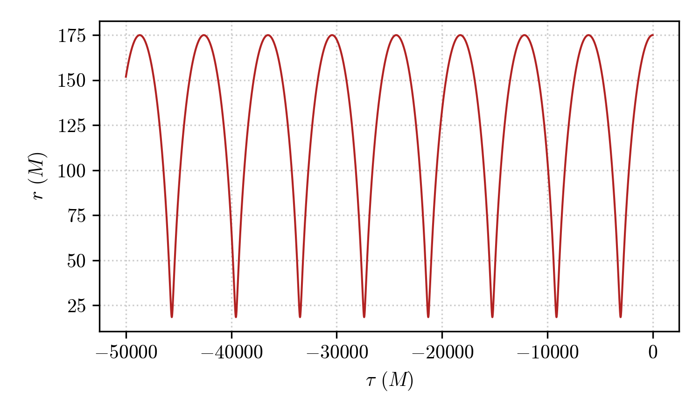
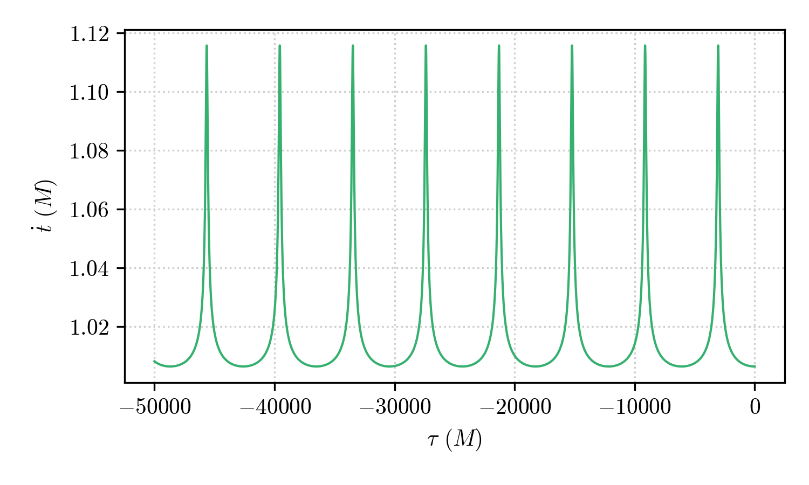

Visualize the results
===================================

Let's consider a :py:class:`.Geodesic` object that has been integrated by following the procedures shown in the previous tutorials (see :doc:`integrate_geodesic`).

For example, let's consider the following geodesic in the Schwarzschild space-time:

.. code-block::

    geo = pygro.Geodesic("time-like", geo_engine)
    geo.set_starting_point(0, 175, np.pi/2, 0)
    geo.set_starting_4velocity(u1 = 0, u2 = 0, u3 = 2e-4)
    geo_engine.integrate(geo, 50000, 1)

We want to visualize the results of the integration.

First of all we can access the ``exit`` status of the geodesic 

.. code-block::

    print(geo.exit)
    
which is assigned by the :py:class:`.GeodesicEngine` object. In this case we obtain

.. code-block:: text

    >>> 'done'

signaling that the integration has been carried on for the entire interval of proper time indicated in the :py:meth:`~pygro.GeodesicEngine.integrate` method. If a :py:class:`.StoppingCriterion` has been met the ``exit`` status of the :py:class:`.Geodesic` will correspond to the exit message of the criterion that stopped the integration (see :doc:`integrate_geodesic`).

Once the geodesic has been integrated, the properties ``Geodesic.tau``, ``Geodesic.x``, and ``Geodesic.u`` will be filled with the arrays of proper times, integrated space-time cooridinates and components of the 4-velocity along the geodesic, respectively.

We can access them and plot them directly, by doing for example (using `Matplotlib <https://matplotlib.org>`_)

.. code-block::

    import matplotlib.pyplot as plt

    fig, ax = plt.subplots()

    ax.plot(geo.tau, geo.x[:,1])

    ax.set_xlabel(r"$\tau$ ($M$)")
    ax.set_ylabel(r"$r$ ($M$)")

which outputs

showing the radial component (``geo.x[:,1]``) as a function of the proper time (``geo.tau``).

We can do the same with the other components, or with any component of the 4-velocity. For example, one can plot the 0-th component of the integrated geodesic (in our case :math:`\dot{t}`)

.. code-block::

    fig, ax = plt.subplots()

    ax.plot(geo.tau, geo.u[:,0])

    ax.set_xlabel(r"$\tau$ ($M$)")
    ax.set_ylabel(r"$\dot{t}$ ($M$)")

and obtain

which clearly shows the Einstein delay (combination of gravitational redshift and Lorentz time-dilation) experienced by the orbit as it gets nearer of farther from the black hole.

Another possibility is to use the :py:meth:`~pygro.metric_engine.Metric.transform` of the :py:class:`.Metric` object (which is available only if ``transform_functions`` have been passed when the metric has been initialized, see :doc:`create_metric`). This fuction acts on the integrated components of the geodesic and applies the transformation defined in the ``transform_functions``, returning the an array of transformed values. 

Having defined transformations to a pseudo-cartesian coordiante system (*i.e.* treating the Schwarzschild components as if they were actual spherical coordinates) one can transform the integrated geodesic by passing the transposed ``geo.x`` array, which is a :math:`4\times N` array, to the :py:meth:`~pygro.metric_engine.Metric.transform` method

.. code-block::

    t, x, y, z = metric.transform(geo.x.T)

which one can directly plot

.. code-block::

    fig, ax = plt.subplots()

    ax.plot(x, y)
    
    # adding the central black hole

    theta = np.linspace(0, 2*np.pi, 150)
    x_bh = 2*np.cos(theta)
    y_bh = 2*np.sin(theta)

    ax.fill(x_bh, y_bh, color = "k")

obtaining a nice representation of the orbit:

.. image:: _static/time_like/time_like_geodesic_example_1.png
  :width: 100%
  :alt: Transformed time-like geodesic visualization

Of course, one can do the same with photons (null geodesics) and obtain a representation of a bundle of geodesics fired by an observer towards the black hole, assigning a color to the conditionally, given the ``exit`` state of the geodesic

.. code-block::

    import matplotlib as mpl
    import matplotlib.pylot as plt

    # Computing geodesics

    phi_arr = np.linspace(-np.pi/2, np.pi/2, 101)

    observer = pygro.Observer(metric, [0, 50, np.pi/2, 0], coframe = ["sqrt(A(r))*dt", "-dr/sqrt(A(r))", "-r*sin(theta)*dphi", "-r*dtheta"])

    geo_arr = []

    for phi in phi_arr:
        geo = pygro.Geodesic("null", geo_engine, verbose = False)
        geo.initial_x = observer.x
        geo.initial_u = observer.from_f1(0, phi, type = geo.type)
        
        geo_engine.integrate(geo, 1000, 1, verbose = False)

        geo_arr.append(geo)

    # Plotting result

    fig, ax = plt.subplots(figsize = (7, 4.5))

    cmap = plt.get_cmap('coolwarm')
    norm = mpl.colors.Normalize(vmin=-np.pi/2, vmax=np.pi/2)
    mappable = mpl.cm.ScalarMappable(norm=norm, cmap=cmap)

    for geo, phi in zip(geo_arr, phi_arr):
        t, x, y, z = metric.transform(geo.x.T)
        ax.plot(x, y, color = mappable.to_rgba(phi) if geo.exit != "horizon" else "k", linewidth = 1) # Color is assigned conditionally depending on wheter the geodesic hit the horizon

    # Adding the black hole

    theta = np.linspace(0, 2*np.pi, 150)
    x_bh = 2*np.cos(theta)
    y_bh = 2*np.sin(theta)

    ax.fill(x_bh, y_bh, color = "k")

    ax.set_xlabel(r'$x$ ($M$)')
    ax.set_ylabel(r'$y$ ($M$)')

which gives out the following representation

